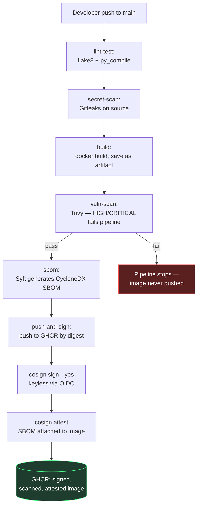

# Diagrams

Both diagrams render natively on GitHub (Mermaid syntax, no external tool
needed). These are the polished versions of a hand-drawn Excalidraw draft
made earlier.

## 1. Build / Release Flow (Supply Chain, CI/CD)

**Key point:** no image reaches production without first passing
scan + SBOM + sign gates. Signing is done on the **digest**, not on a
mutable tag — the deploy script references the digest as well.

## 2. Runtime Request Flow (Trust Boundaries Marked)

```mermaid
flowchart TD
    subgraph internet["🌐 Internet / External Client"]
        C1[Client]
    end

    subgraph edgenet["edge-net (overlay) — only network with a published port"]
        T[Traefik<br/>:80 published<br/>rate-limit: 5 req/s avg, burst 10]
    end

    subgraph appnet["app-net (overlay) — no published ports,<br/>unreachable from outside"]
        A1[app replica 1]
        A2[app replica 2]
        P[Prometheus<br/>scrapes app:8080/metrics]
        G[Grafana<br/>:3000 published — known shortcut]
    end

    C1 -->|HTTPS/HTTP| T
    T -->|"JWT validated in-app,<br/>not at edge"| A1
    T --> A2
    P -.scrape.-> A1
    P -.scrape.-> A2
    G -.query.-> P
    C1 -.->|"direct :3000 (shortcut,<br/>should go via edge in prod)"| G

    A1 -->|"tenant_id from<br/>verified JWT only"| DB1[(FAKE_DB<br/>scoped per tenant_id)]
    A2 --> DB1

    style edgenet fill:#1a2a3a,stroke:#4da6ff
    style appnet fill:#2a1a2a,stroke:#ff9d4d
    style internet fill:#1a1a1a,stroke:#888
```

**Trust boundaries marked here:**
1. **Internet ↔ edge-net**: the only crossing point. Only Traefik's ports
   (80, and demo-only 8081) are published.
2. **edge-net ↔ app-net**: Traefik bridges the two networks; the `app`
   service is on `app-net` **only**, with no published port — so a client
   cannot reach `app` directly and must go through Traefik (proven by
   `verify_network_boundary.sh`).
3. **Inside the app**: `tenant_id` is trusted only after JWT signature
   verification — never taken directly from a header or query parameter.
   Every DB lookup is scoped by that verified `tenant_id`.
4. **Known shortcut**: Grafana is also on `edge-net` and publishes port
   3000 directly — in production this should also go behind Traefik with
   TLS and auth (see design note for details).
