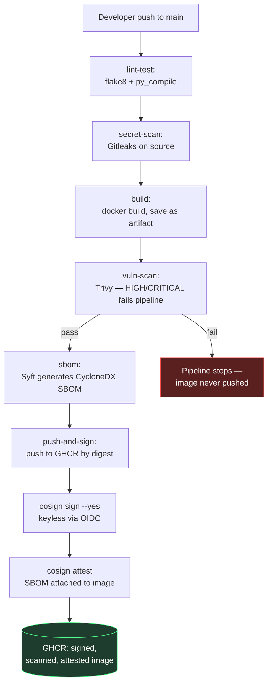

# Diagrams

এই দুইটা diagram GitHub-এ সরাসরি render হবে (Mermaid syntax, কোনো এক্সটার্নাল
টুল লাগে না)। Excalidraw দিয়ে হাতে-আঁকা draft থেকে এইগুলো polish করা হয়েছে।

## ১. Build / Release Flow (Supply-chain, CI/CD)

**মূল কথা:** কোনো image production-এ যাওয়ার আগে বাধ্যতামূলকভাবে scan +
SBOM + sign পার হতে হয় (gate)। Signing হয় **digest**-এর উপর, mutable tag-এর
উপর না — deploy script-ও digest রেফারেন্স করে।

## ২. Runtime Request Flow (Trust boundary চিহ্নিত)

```mermaid
flowchart TD
    subgraph internet["🌐 Internet / External Client"]
        C1[Client]
    end

    subgraph edgenet["edge-net (overlay) — শুধু এখানেই published port"]
        T[Traefik<br/>:80 published<br/>rate-limit: 5 req/s avg, burst 10]
    end

    subgraph appnet["app-net (overlay) — কোনো published port নেই,<br/>বাইরে থেকে unreachable"]
        A1[app replica 1]
        A2[app replica 2]
        P[Prometheus<br/>scrapes app:8080/metrics]
        G[Grafana<br/>:3000 published — known shortcut]
    end

    C1 -->|HTTPS/HTTP| T
    T -->|"JWT validated in-app,<br/>not at edge"| A1
    T --> A2
    P -.scrape.-> A1
    P -.scrape.-> A2
    G -.query.-> P
    C1 -.->|"direct :3000 (shortcut,<br/>should go via edge in prod)"| G

    A1 -->|"tenant_id from<br/>verified JWT only"| DB1[(FAKE_DB<br/>scoped per tenant_id)]
    A2 --> DB1

    style edgenet fill:#1a2a3a,stroke:#4da6ff
    style appnet fill:#2a1a2a,stroke:#ff9d4d
    style internet fill:#1a1a1a,stroke:#888
```

**Trust boundary যা এখানে মার্ক করা:**
1. **Internet ↔ edge-net**: একমাত্র crossing point। শুধু Traefik-এর port
   (80, এবং demo-only 8081) publish করা।
2. **edge-net ↔ app-net**: Traefik দুই network-এই আছে বলে সেতুর কাজ করে;
   `app` service-টা **শুধু** `app-net`-এ, কোনো published port নেই — তাই
   client সরাসরি `app`-এ পৌঁছাতে পারে না, বাধ্যতামূলক Traefik দিয়ে যেতে হয়
   (এটা `verify_network_boundary.sh` দিয়ে প্রমাণিত)।
3. **App-এর ভেতরে**: JWT signature verify হওয়ার পরেই `tenant_id`
   trust করা হয় — কোনো header/query param থেকে সরাসরি না। প্রতিটা DB
   lookup সেই verified `tenant_id` দিয়ে scoped।
4. **Known shortcut**: Grafana `edge-net`-এও আছে এবং সরাসরি port 3000
   publish করছে — production-এ এটাও Traefik-এর পেছনে TLS + auth সহ
   যাওয়া উচিত (design note-এ বিস্তারিত)।
